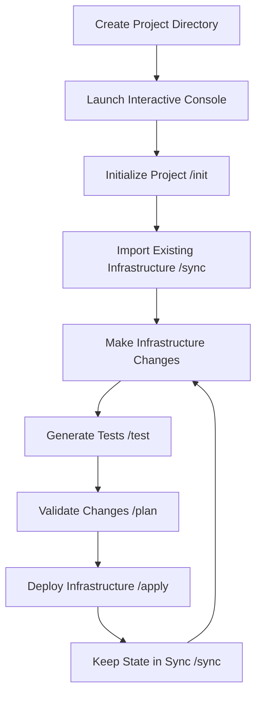

# Proxmox-MPC Documentation

!!! success "v1.0.0 Production Release"
Proxmox-MPC v1.0.0 is now available! A production-ready Interactive Infrastructure-as-Code Console with 96.8% test success rate and comprehensive validation on real Proxmox infrastructure.

## Welcome to Proxmox-MPC

**Proxmox-MPC** is an Interactive Infrastructure-as-Code Console for Proxmox Virtual Environment that provides a **Claude Code-like experience** for managing your virtualization infrastructure. Transform your Proxmox environment into declarative, version-controlled Infrastructure-as-Code with automatic Terraform and Ansible generation.

<div class="grid cards" markdown>

- :fontawesome-solid-rocket:{ .lg .middle } **Quick Start**

  ***

  Get up and running in minutes with our comprehensive quick start guide

  [:octicons-arrow-right-24: Quick Start](getting-started/quick-start.md)

- :fontawesome-solid-terminal:{ .lg .middle } **Interactive Console**

  ***

  Claude Code-like interactive console with slash commands and project workspaces

  [:octicons-arrow-right-24: Console Guide](user-guide/interactive-console.md)

- :fontawesome-solid-code:{ .lg .middle } **Infrastructure as Code**

  ***

  Automatic Terraform and Ansible generation from existing infrastructure

  [:octicons-arrow-right-24: IaC Features](features/infrastructure-as-code.md)

- :fontawesome-solid-book:{ .lg .middle } **API Reference**

  ***

  Complete command reference for both CLI and interactive console

  [:octicons-arrow-right-24: Reference](reference/console-commands.md)

</div>

## Key Capabilities

### :material-console: Interactive Console Experience

```bash
$ proxmox-mpc                    # Launch interactive console
proxmox-mpc> /init              # Initialize new project workspace
proxmox-mpc> /sync              # Discover & sync existing infrastructure
proxmox-mpc> create vm --name web-01  # Generate IaC files for new resources
proxmox-mpc> /test              # Validate infrastructure changes
proxmox-mpc> /apply             # Deploy to Proxmox server
```

### :material-database: Professional CLI Interface

```bash
# Connection and discovery
npm run cli test-connection [-v]    # Test Proxmox API connectivity
npm run cli list-nodes [-v]         # List cluster nodes
npm run cli discover-vms            # List VMs with status

# VM/Container management
npm run cli vm create --vmid 100 --name web-01 --cores 2
npm run cli vm start 100 --wait     # Start VM
npm run cli container create --vmid 200 --ostemplate ubuntu
```

### :material-file-tree: Generated Project Structure

Each project workspace includes automatically generated Infrastructure-as-Code:

```
my-proxmox-project/
├── .proxmox/
│   ├── config.yml           # Server connection details
│   ├── state.db            # Local SQLite database
│   └── history/            # Infrastructure state snapshots
├── terraform/
│   ├── main.tf             # Generated main configuration
│   ├── nodes.tf            # Node resources
│   ├── vms/                # Individual VM configurations
│   └── containers/         # Individual container configurations
├── ansible/
│   ├── inventory.yml       # Generated inventory
│   ├── playbooks/          # Configuration playbooks
│   └── roles/              # Reusable roles
├── tests/
│   ├── infrastructure.test.js  # Generated infrastructure tests
│   └── integration/        # Integration test suites
└── docs/
    └── architecture.md     # Generated documentation
```

## Core Features

### :material-sync: State Synchronization

- **Bidirectional sync** between Proxmox server, local database, and IaC files
- **State tracking** with comprehensive history and rollback capabilities
- **Conflict resolution** with intelligent merge strategies

### :material-test-tube: Test-Driven Infrastructure

- **Automatic test generation** for infrastructure changes
- **Validation workflows** with comprehensive quality gates
- **Integration testing** with real infrastructure validation

### :material-server-network: Multi-Interface Design

- **Interactive Console**: Claude Code-like REPL experience
- **Professional CLI**: 20+ commands for scripting and automation
- **Planned Web UI**: Dashboard for visual management
- **Future MCP Server**: AI model integration capabilities

### :material-shield-check: Production Ready

- **96.8% test success rate** (509/526 tests passing)
- **Version 1.0.0** - First major production release
- **Comprehensive validation** with real Proxmox server testing
- **Professional error handling** and user-friendly diagnostics
- **SSL certificate handling** for homelab environments

## Technology Stack

<div class="grid cards" markdown>

- **Backend**

  ***
  - Node.js/TypeScript
  - Prisma ORM
  - SQLite/PostgreSQL
  - Express.js framework

- **CLI & Console**

  ***
  - Commander.js framework
  - Readline interface
  - Professional error handling
  - Session management

- **Infrastructure**

  ***
  - Terraform generation
  - Ansible playbooks
  - Test automation
  - State management

- **Integration**

  ***
  - Proxmox VE 8.4.1+
  - API token authentication
  - Multi-server support
  - Observability system

</div>

## Typical Workflow



## Getting Started

Ready to get started? Follow our comprehensive guides:

1. **[Installation](getting-started/installation.md)** - Install Proxmox-MPC on your system
2. **[Quick Start](getting-started/quick-start.md)** - 5-minute walkthrough from installation to first VM
3. **[First Project](getting-started/first-project.md)** - Detailed project creation tutorial
4. **[Authentication](getting-started/authentication.md)** - Set up Proxmox API access

## Documentation Framework

This documentation is built with professional standards and governance:

- **[Documentation Standards](DOCUMENTATION_STANDARDS.md)** - Style guide and quality standards
- **[Content Lifecycle](CONTENT_LIFECYCLE.md)** - Content management and maintenance processes
- **[Templates](templates/README.md)** - Standardized templates for consistent documentation
- **Quality Assurance** - Automated validation and review processes

## Support & Community

- **Documentation**: Comprehensive guides and API reference with professional governance
- **Issues**: [GitHub Issues](https://github.com/proxmox-mpc/proxmox-mpc/issues) for bug reports and feature requests
- **Discussions**: [GitHub Discussions](https://github.com/proxmox-mpc/proxmox-mpc/discussions) for community support
- **Contributing**: [Development Guide](development/contributing.md) for contributors

## What's Next?

Proxmox-MPC is actively developed with exciting features planned:

- **Phase 6**: Advanced observability and diagnostics
- **Phase 7**: MCP server for AI model integration
- **Phase 8-9**: Web dashboard and enterprise features

---

_Transform your Proxmox infrastructure into declarative, version-controlled Infrastructure-as-Code with the power and simplicity of modern tooling._
