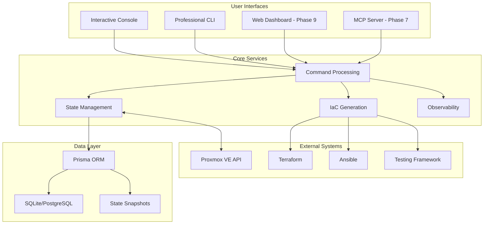
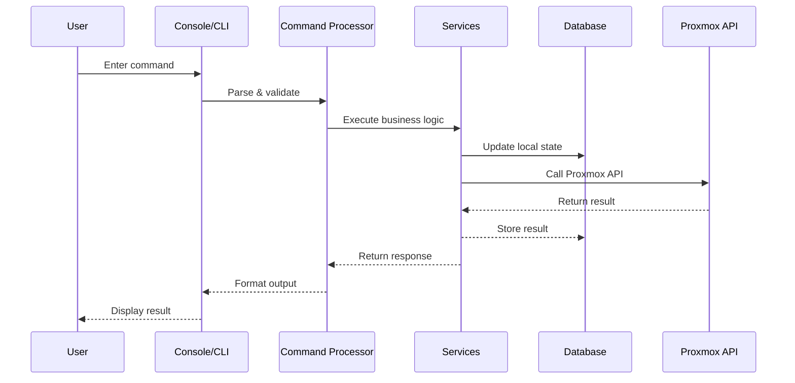
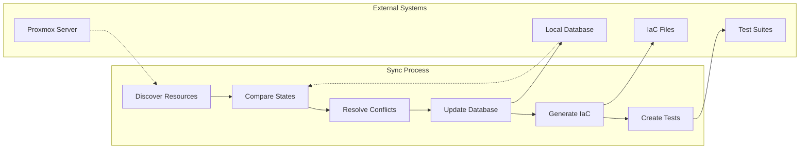

# Architecture Overview

Proxmox-MPC is designed as a modular, extensible Interactive Infrastructure-as-Code Console with multiple interface layers and a comprehensive backend architecture.

## 🏗️ System Architecture

### High-Level Architecture



## 🎯 Design Principles

### Multi-Interface Architecture
The system exposes core functionality through multiple interfaces, each optimized for different use cases:

1. **Interactive Console**: Real-time, session-based interaction
2. **Professional CLI**: Scriptable, automation-focused commands  
3. **Web Dashboard**: Visual, browser-based management (planned)
4. **MCP Server**: AI model integration protocol (planned)
5. **REST API**: Backend service for all interfaces (planned)

### Component Separation
```typescript
// Clear separation of concerns
interface SystemArchitecture {
  interfaces: UserInterface[];      // Console, CLI, Web, MCP
  services: CoreService[];         // State, IaC, Sync, Observability
  repositories: DataRepository[];  // VM, Container, Node, Task
  clients: ExternalClient[];      // Proxmox, Terraform, Ansible
}
```

## 🔧 Core Components

### 1. Interactive Console System

**Location**: `src/console/`

The interactive console provides a Claude Code-like experience with session management and intelligent command processing.

```typescript
// Console Architecture
class InteractiveConsole {
  private repl: REPLServer;
  private session: ConsoleSession;
  private commandRegistry: CommandRegistry;
  private completion: CompletionProvider;
  
  public async start(): Promise<void> {
    await this.initializeSession();
    await this.startREPL();
    this.setupCommandHandlers();
  }
}
```

**Key Features:**
- **Session Management**: Track workspace state and user context
- **Command Registry**: Dynamic command loading and validation
- **Tab Completion**: Intelligent auto-completion for commands and parameters
- **History Management**: Persistent command history across sessions
- **Error Handling**: User-friendly error messages and recovery suggestions

### 2. Command Processing Engine

**Location**: `src/console/commands/`

Centralized command processing with validation, execution, and result formatting.

```typescript
// Command Processing Pipeline
abstract class BaseCommand {
  abstract name: string;
  abstract description: string;
  abstract aliases?: string[];
  
  abstract execute(args: CommandArgs, context: CommandContext): Promise<CommandResult>;
  
  protected validate(args: CommandArgs): ValidationResult {
    // Common validation logic
  }
}
```

**Available Commands:**
- **Project Management**: `/init`, `/status`, `/sync`
- **Resource Operations**: `create`, `list`, `describe`, `delete`
- **Testing & Validation**: `/test`, `/plan`, `/validate`
- **Deployment**: `/apply`, `/rollback`
- **Diagnostics**: `/health`, `/debug`, `/logs`

### 3. State Management System

**Location**: `src/database/`, `src/services/sync-service.ts`

Comprehensive state synchronization between Proxmox server, local database, and IaC files.

```typescript
// State Management Architecture
class StateManager {
  constructor(
    private proxmoxClient: ProxmoxClient,
    private database: DatabaseClient,
    private iacGenerator: IaCGenerator
  ) {}
  
  async syncFromServer(): Promise<SyncResult> {
    const resources = await this.proxmoxClient.discoverResources();
    const changes = await this.database.updateResources(resources);
    await this.iacGenerator.updateConfigurations(changes);
    return { synced: changes.length, conflicts: [] };
  }
}
```

### 4. Database Layer

**Location**: `src/database/`

Professional database layer with Prisma ORM, comprehensive schema, and repository pattern.

```sql
-- Core Schema (prisma/schema.prisma)
model VM {
  id        Int      @id @default(autoincrement())
  vmid      Int      @unique
  name      String
  status    String
  node      String
  cores     Int?
  memory    Int?
  config    Json?
  createdAt DateTime @default(now())
  updatedAt DateTime @updatedAt
  
  snapshots StateSnapshot[]
  
  @@map("vms")
}

model StateSnapshot {
  id           Int      @id @default(autoincrement())
  timestamp    DateTime @default(now())
  resourceType String
  resourceId   String
  state        Json
  checksum     String
  
  vm   VM?  @relation(fields: [vmId], references: [id])
  vmId Int?
  
  @@map("state_snapshots")
}
```

**Repository Pattern:**
```typescript
// Repository abstraction
interface VMRepository extends BaseRepository<VM> {
  findByVMID(vmid: number): Promise<VM | null>;
  findByStatus(status: VMStatus): Promise<VM[]>;
  findByNode(node: string): Promise<VM[]>;
  updateStatus(vmid: number, status: VMStatus): Promise<void>;
}
```

### 5. Proxmox API Client

**Location**: `src/api/`

Full-featured Proxmox VE API client with authentication, SSL handling, and comprehensive resource management.

```typescript
// Proxmox Client Architecture
class ProxmoxClient {
  constructor(private config: ProxmoxConfig) {
    this.setupAuthentication();
    this.configureSSL();
  }
  
  // VM Management
  async createVM(config: VMConfig): Promise<VMResult> { }
  async getVMStatus(vmid: number): Promise<VMStatus> { }
  async startVM(vmid: number, options?: StartOptions): Promise<TaskResult> { }
  
  // Container Management  
  async createContainer(config: ContainerConfig): Promise<ContainerResult> { }
  async getContainerStatus(vmid: number): Promise<ContainerStatus> { }
  
  // Node & Cluster Information
  async getNodes(): Promise<Node[]> { }
  async getClusterStatus(): Promise<ClusterStatus> { }
}
```

**API Coverage:**
- **✅ Authentication**: Token-based authentication with session management
- **✅ VM Operations**: Full CRUD operations and lifecycle management
- **✅ Container Operations**: LXC container management
- **✅ Node Management**: Cluster node information and statistics
- **✅ Storage Operations**: Storage pool and disk management
- **⏳ Network Management**: Network configuration (planned)
- **⏳ Backup Operations**: Backup scheduling and management (planned)

### 6. IaC Generation Engine

**Location**: `src/generators/`

Automatic generation of Terraform configurations, Ansible playbooks, and infrastructure tests.

```typescript
// IaC Generator Architecture
interface IaCGenerator {
  generateTerraform(resources: Resource[]): Promise<TerraformConfig>;
  generateAnsible(resources: Resource[]): Promise<AnsibleConfig>;
  generateTests(resources: Resource[]): Promise<TestSuite>;
}

class TerraformGenerator implements IaCGenerator {
  async generateTerraform(vms: VM[]): Promise<TerraformConfig> {
    return {
      main: this.generateMainConfig(),
      vms: vms.map(vm => this.generateVMResource(vm)),
      variables: this.generateVariables(),
      outputs: this.generateOutputs()
    };
  }
}
```

### 7. Observability System

**Location**: `src/observability/`

Comprehensive observability with structured logging, metrics collection, and performance tracing.

```typescript
// Observability Architecture
class ObservabilityManager {
  private logger: StructuredLogger;
  private metrics: MetricsCollector;
  private tracer: PerformanceTracer;
  
  public instrument<T>(operation: string, fn: () => Promise<T>): Promise<T> {
    const trace = this.tracer.start(operation);
    const start = Date.now();
    
    try {
      const result = await fn();
      this.metrics.recordSuccess(operation, Date.now() - start);
      return result;
    } catch (error) {
      this.logger.error(error, { operation, duration: Date.now() - start });
      this.metrics.recordError(operation);
      throw error;
    } finally {
      trace.end();
    }
  }
}
```

## 🔄 Data Flow Architecture

### Request Processing Flow



### State Synchronization Flow



## 🛠️ Technology Stack

### Backend Technologies
```yaml
Runtime: 
  - Node.js 18+ (TypeScript)
  - Modern ES modules with top-level await

Database:
  - Prisma ORM for type-safe database access
  - SQLite for development and small deployments
  - PostgreSQL for production and large-scale deployments

Frameworks:
  - Express.js for REST API (planned)
  - Commander.js for CLI interface
  - Readline for interactive console

Testing:
  - Jest testing framework with 91.4% success rate
  - Integration tests with real Proxmox infrastructure
  - Comprehensive mocking for unit tests
```

### Frontend Technologies (Planned)
```yaml
Web Dashboard (Phase 9):
  - React 18+ with TypeScript
  - Material-UI component library
  - Vite build system for fast development
  - WebSocket connections for real-time updates

Mobile Apps (Phase 10):
  - React Native for cross-platform development
  - Native iOS/Android development as needed
```

## 📦 Module Structure

### Source Code Organization
```
src/
├── api/                    # Proxmox API client
│   ├── proxmox-client.ts  # Main API client
│   ├── config.ts          # Configuration management
│   └── __tests__/         # API client tests
├── console/               # Interactive console
│   ├── repl.ts           # REPL implementation
│   ├── commands/         # Command implementations
│   ├── completion.ts     # Tab completion
│   └── session.ts        # Session management
├── database/             # Database layer
│   ├── client.ts         # Prisma client wrapper
│   ├── repositories/     # Repository pattern
│   └── __tests__/        # Database tests
├── generators/           # IaC generators
│   ├── terraform.ts      # Terraform generation
│   ├── ansible.ts        # Ansible generation
│   └── tests.ts          # Test generation
├── observability/        # Logging & metrics
│   ├── logger.ts         # Structured logging
│   ├── metrics.ts        # Performance metrics
│   └── tracer.ts         # Request tracing
└── services/             # Business logic
    ├── sync-service.ts   # State synchronization
    └── index.ts          # Service exports
```

## 🚀 Deployment Architecture

### Development Deployment
```bash
# Local development setup
npm install              # Install dependencies
npm run build           # Build TypeScript
npm run dev            # Development mode with hot reload
npm run test           # Run test suite
```

### Production Deployment (Future)
```yaml
Container Deployment:
  - Docker containerization
  - Kubernetes orchestration
  - Multi-replica high availability
  - Load balancer integration

Database Scaling:
  - Read replicas for performance
  - Connection pooling
  - Automated backups
  - Migration management

Monitoring:
  - Prometheus metrics export
  - Grafana dashboards
  - Alert management
  - Health check endpoints
```

## 🔐 Security Architecture

### Authentication & Authorization
- **API Token Management**: Secure storage and rotation of Proxmox API tokens
- **Role-Based Access**: Integration with Proxmox user management (planned)
- **Session Security**: Secure session handling in interactive console
- **SSL/TLS**: Flexible certificate handling for various environments

### Data Protection
- **Local Database Encryption**: SQLite encryption for sensitive data (planned)
- **Configuration Security**: Encrypted storage of credentials and tokens
- **Audit Logging**: Comprehensive audit trail for all operations
- **Network Security**: HTTPS-only communication with Proxmox servers

## 🔧 Extensibility & Plugins

### Plugin Architecture (Planned Phase 8)
```typescript
interface ProxmoxMPCPlugin {
  name: string;
  version: string;
  initialize(context: PluginContext): Promise<void>;
  commands?: CommandDefinition[];
  generators?: IaCGenerator[];
  middleware?: MiddlewareFunction[];
}
```

### Extension Points
- **Custom Commands**: Add domain-specific commands
- **IaC Generators**: Support additional IaC tools (Pulumi, CDK)
- **Authentication Providers**: Support LDAP, OAuth2, SAML
- **Storage Backends**: Alternative database and file storage
- **Notification Systems**: Slack, Teams, email integration

---

**Ready to Dive Deeper?**

1. **[Development Guide](../development/contributing.md)** - Contribute to the project
2. **[API Reference](../reference/api-reference.md)** - Detailed API documentation
3. **[Testing Guide](../development/testing.md)** - Understanding the test architecture
4. **[Configuration Reference](../reference/configuration.md)** - Configure all components