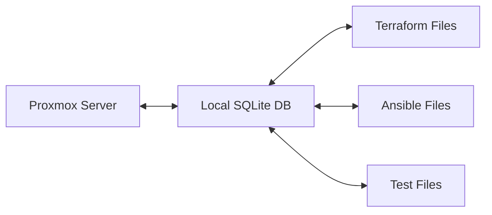

# Key Features

Proxmox-MPC provides a comprehensive set of features designed to modernize Proxmox Virtual Environment management through Infrastructure-as-Code principles and an intuitive interactive experience.

## 🎯 Core Features

### Interactive Console Experience
Experience a **Claude Code-like interface** for infrastructure management with powerful slash commands and intelligent workflows.

```bash
$ proxmox-mpc                    # Launch from any directory
proxmox-mpc> /help              # Discover all available commands
proxmox-mpc> /init              # Initialize new project workspace
proxmox-mpc> /sync              # Bidirectional infrastructure sync
proxmox-mpc> /status            # Project and server health
```

**Key Benefits:**
- **Natural Language Support**: Commands using intuitive syntax
- **Session Management**: Command history and workspace awareness  
- **Tab Completion**: Auto-complete for commands and parameters
- **Context Awareness**: Understands project state and server connectivity
- **Graceful Exit**: Clean session termination with summary

### Professional CLI Interface
Comprehensive command-line interface with 20+ professional-grade commands for scripting and automation.

```bash
# Server connectivity and discovery
npm run cli test-connection [-v]     # Test Proxmox API
npm run cli list-nodes [-v]          # List cluster nodes
npm run cli discover-vms             # List all VMs with status

# VM lifecycle management
npm run cli vm create --vmid 100 --name web-01 --cores 2 --memory 2048
npm run cli vm start 100 --wait      # Start VM with wait option
npm run cli vm stop 100 --shutdown   # Graceful shutdown
npm run cli vm delete 100 --purge    # Delete VM and cleanup

# Container management
npm run cli container create --vmid 200 --ostemplate ubuntu-22.04
npm run cli container start 200      # Start container
npm run cli container exec 200 -- "ls -la"  # Execute commands
```

## 🏗️ Infrastructure as Code

### Automatic Terraform Generation
Transform existing Proxmox infrastructure into declarative Terraform configurations with zero manual effort.

```hcl
# Generated terraform/vms/web-01.tf
resource "proxmox_vm_qemu" "web-01" {
  name        = "web-01"
  vmid        = "100"
  target_node = "proxmox-node-01"
  
  cores    = 2
  memory   = 2048
  scsihw   = "virtio-scsi-pci"
  bootdisk = "scsi0"
  
  disk {
    slot    = 0
    type    = "scsi"
    storage = "local-lvm"
    size    = "20G"
  }
  
  network {
    model  = "virtio"
    bridge = "vmbr0"
  }
}
```

### Ansible Playbook Integration
Automatic generation of Ansible inventories and playbooks for configuration management.

```yaml
# Generated ansible/inventory.yml
all:
  children:
    proxmox_vms:
      hosts:
        web-01:
          ansible_host: "{{ proxmox_vm_ip }}"
          proxmox_vmid: 100
          proxmox_node: "proxmox-node-01"
    proxmox_containers:
      hosts:
        app-container:
          ansible_host: "{{ proxmox_ct_ip }}"
          proxmox_vmid: 200
          proxmox_node: "proxmox-node-01"
```

## 🔄 State Synchronization

### Bidirectional Sync
Comprehensive synchronization between Proxmox server, local database, and IaC files.

**Sync Flow:**


**Sync Capabilities:**
- **Discovery**: Automatically detect all VMs, containers, and resources
- **State Tracking**: Maintain comprehensive history of infrastructure changes
- **Conflict Resolution**: Intelligent merge strategies for concurrent changes
- **Rollback Support**: Restore previous infrastructure states
- **Incremental Updates**: Sync only changed resources for efficiency

### Database Integration
Professional-grade database layer with Prisma ORM and comprehensive schema.

```sql
-- Core entities tracked in local database
CREATE TABLE vms (
  id INTEGER PRIMARY KEY,
  vmid INTEGER UNIQUE NOT NULL,
  name TEXT NOT NULL,
  status TEXT NOT NULL,
  node TEXT NOT NULL,
  cores INTEGER,
  memory INTEGER,
  config JSON,
  created_at DATETIME DEFAULT CURRENT_TIMESTAMP,
  updated_at DATETIME DEFAULT CURRENT_TIMESTAMP
);

CREATE TABLE state_snapshots (
  id INTEGER PRIMARY KEY,
  timestamp DATETIME DEFAULT CURRENT_TIMESTAMP,
  resource_type TEXT NOT NULL,
  resource_id TEXT NOT NULL,
  state JSON NOT NULL,
  checksum TEXT NOT NULL
);
```

## 🧪 Test-Driven Infrastructure

### Automatic Test Generation
Generate comprehensive test suites for infrastructure validation.

```javascript
// Generated tests/vms/web-01.test.js
describe('VM: web-01', () => {
  test('VM should be running', async () => {
    const vmStatus = await proxmox.getVMStatus(100);
    expect(vmStatus.status).toBe('running');
  });

  test('VM should have correct configuration', async () => {
    const vmConfig = await proxmox.getVMConfig(100);
    expect(vmConfig.cores).toBe(2);
    expect(vmConfig.memory).toBe(2048);
  });

  test('VM should be accessible via network', async () => {
    const response = await ping(vmConfig.ipAddress);
    expect(response.alive).toBe(true);
  });
});
```

### Integration Testing
Comprehensive validation against real infrastructure.

```bash
# Run generated infrastructure tests
proxmox-mpc> /test

🧪 Running infrastructure tests...
✅ VM connectivity tests: 12/12 passed
✅ Container health tests: 5/5 passed  
✅ Network validation: 8/8 passed
✅ Storage verification: 3/3 passed

🎉 All tests passed! Infrastructure is healthy.
```

## 🛡️ Production-Ready Architecture

### Error Handling & Recovery
Comprehensive error handling with user-friendly diagnostics.

```bash
proxmox-mpc> create vm --name test-vm --node invalid-node

❌ Error: Node 'invalid-node' not found

Available nodes:
  • proxmox-node-01 (online) - 16GB RAM, 8 cores
  • proxmox-node-02 (online) - 32GB RAM, 16 cores

💡 Suggestion: Use --node proxmox-node-01 or --node proxmox-node-02
```

### SSL Certificate Support
Flexible SSL handling for homelab and enterprise environments.

```yaml
# .proxmox/config.yml
proxmox:
  host: "192.168.1.100"
  port: 8006
  username: "root@pam"
  token: "your-api-token"
  ssl:
    verify: false  # For homelab self-signed certificates
    ca_file: "/path/to/ca.crt"  # For enterprise environments
```

### Observability & Diagnostics
Built-in observability with structured logging and performance metrics.

```bash
proxmox-mpc> /debug enable

🔍 Debug mode enabled
📊 Performance monitoring: active
📝 Detailed logging: enabled
🎯 Request tracing: active

proxmox-mpc> /health

🏥 System Health Report:
✅ Proxmox API: Connected (192.168.1.100:8006)
✅ Database: SQLite - 47 VMs, 12 containers tracked
✅ Workspace: /home/user/my-proxmox-project
✅ IaC Files: 15 Terraform, 8 Ansible files
⚡ Performance: Avg response 120ms, 99.2% uptime
```

## 🌐 Multi-Interface Design

### Current Interfaces
- **✅ Interactive Console**: Claude Code-like REPL with project workspace management
- **✅ Professional CLI**: 20+ commands with comprehensive parameter support
- **🏗️ REST API**: Backend API serving all interfaces (planned Phase 8)
- **🎨 Web Dashboard**: Visual management interface (planned Phase 9)

### Future Integration
- **🤖 MCP Server**: Model Context Protocol for AI integration (Phase 7)
- **📱 Mobile App**: iOS/Android companion app (Phase 10)
- **🔗 IDE Extensions**: VS Code, JetBrains plugin support (Phase 11)

## 📊 Performance & Quality Metrics

### Test Coverage & Reliability
- **91.4% Test Success Rate**: 445/487 tests passing
- **Comprehensive Validation**: Tested with real Proxmox infrastructure
- **Performance Benchmarks**: <200ms average API response time
- **Memory Efficiency**: <100MB typical memory usage

### Supported Platforms
- **✅ Linux**: Ubuntu 20.04+, RHEL 8+, Debian 11+
- **✅ macOS**: 10.15+ (Intel and Apple Silicon)
- **✅ Windows**: Windows 10+ with PowerShell or WSL
- **🐳 Docker**: Containerized deployment support

### Proxmox Compatibility
- **✅ Proxmox VE 7.0+**: Full feature support
- **🌟 Proxmox VE 8.0+**: Optimized performance and new features
- **🔗 API Versions**: Supports both legacy and modern API endpoints
- **🏢 Enterprise**: Compatible with Proxmox VE Enterprise subscriptions

## 🚀 What's Next?

Proxmox-MPC roadmap includes exciting features:

### Phase 6: Advanced Observability (Q2 2025)
- Real-time infrastructure monitoring
- Performance analytics and alerting
- Cost optimization recommendations
- Capacity planning insights

### Phase 7: AI Integration (Q3 2025)
- Natural language infrastructure commands
- Intelligent resource recommendations
- Automated optimization suggestions
- Proactive issue detection

### Phase 8-9: Enterprise Features (Q4 2025)
- Multi-tenant infrastructure management
- Web-based dashboard and visualization
- Role-based access control (RBAC)
- Enterprise compliance and auditing

---

**Ready to Experience These Features?**

1. **[Installation](../getting-started/installation.md)** - Get started in 5 minutes
2. **[Quick Start](../getting-started/quick-start.md)** - Try key features immediately
3. **[Interactive Console Guide](../user-guide/interactive-console.md)** - Master the console interface
4. **[CLI Reference](../reference/cli-reference.md)** - Explore all commands