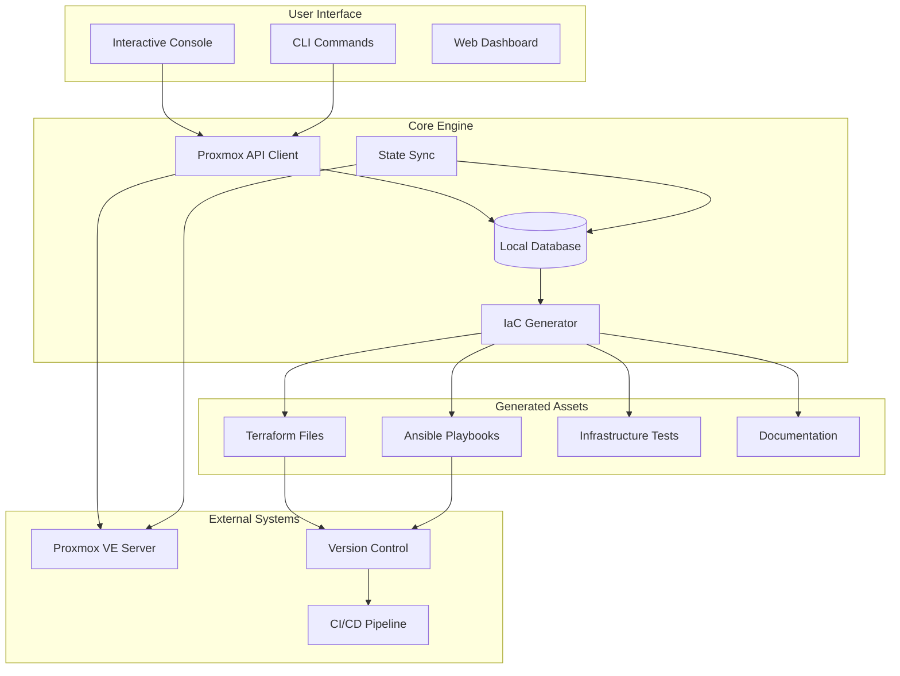

# What is Proxmox-MPC?

**Proxmox-MPC** (Proxmox Management Platform Console) is an Interactive Infrastructure-as-Code Console that transforms how you manage Proxmox Virtual Environment infrastructure. It provides a **Claude Code-like experience** with natural language commands, automatic code generation, and declarative infrastructure management.

## The Problem Proxmox-MPC Solves

### Traditional Proxmox Management Challenges

**Manual Web Interface Management**:
- Click-heavy web interface for every operation
- No version control or infrastructure history
- Difficult to replicate configurations across servers
- No automation or scripting capabilities
- Risk of configuration drift and inconsistencies

**Terraform/Ansible Complexity**:
- Steep learning curve for infrastructure teams
- Manual configuration file creation and maintenance
- Complex state management and synchronization
- No integration between existing infrastructure and code
- Time-consuming setup and ongoing maintenance

**Limited Automation**:
- No natural language interface for common operations
- Scripting requires deep Proxmox API knowledge
- No built-in testing or validation workflows
- Difficult integration with modern DevOps practices

## The Proxmox-MPC Solution

### Interactive Infrastructure-as-Code Console

Proxmox-MPC bridges the gap between manual management and complex automation by providing:

```bash
# Natural language commands that generate Infrastructure-as-Code
proxmox-mpc> create vm --name web-01 --cores 4 --memory 8192
📝 Generated terraform/vms/web-01.tf
📝 Generated ansible/playbooks/web-01.yml  
🧪 Generated tests/vms/web-01.test.js

# Automatic discovery and import of existing infrastructure
proxmox-mpc> /sync
🔄 Discovered 12 VMs, 5 containers
🏗️  Generated complete IaC representation
```

### Key Innovations

#### 1. **Claude Code-Like Experience**
Familiar interactive console interface similar to Claude Code, making infrastructure management intuitive for developers and operations teams.

#### 2. **Automatic IaC Generation** 
Transforms natural language commands and existing infrastructure into production-ready Terraform and Ansible configurations.

#### 3. **Bidirectional State Sync**
Maintains perfect synchronization between your Proxmox server, local database, and Infrastructure-as-Code files.

#### 4. **Project-Based Workspaces**
Each directory becomes a complete infrastructure project with versioned configurations, tests, and documentation.

## Core Concepts

### Project Workspaces
```
my-datacenter/                    # Your infrastructure project
├── .proxmox/
│   ├── config.yml               # Connection settings
│   ├── state.db                # Local state database
│   └── history/                # Change history
├── terraform/                   # Generated Terraform
├── ansible/                     # Generated Ansible
├── tests/                       # Generated tests
└── docs/                       # Generated documentation
```

### Natural Language Interface
```bash
# Instead of complex Terraform syntax:
resource "proxmox_vm_qemu" "web_server" {
  name         = "web-01"
  target_node  = "proxmox-01"
  clone        = "ubuntu-template"
  cores        = 4
  memory       = 8192
  # ... 50+ more lines
}

# Simply use natural language:
proxmox-mpc> create vm --name web-01 --cores 4 --memory 8192
```

### Test-Driven Infrastructure
```bash
proxmox-mpc> /test
🧪 Running infrastructure validation...
  ✅ VM configurations valid
  ✅ Resource allocation checked  
  ✅ Network connectivity verified
  ✅ Storage requirements met
```

## Architecture Overview



## Who Should Use Proxmox-MPC?

### Infrastructure Engineers
- **Reduce complexity** of Terraform/Ansible learning curve
- **Automate** repetitive infrastructure tasks
- **Version control** infrastructure changes
- **Test** infrastructure before deployment

### DevOps Teams  
- **Standardize** infrastructure provisioning
- **Integrate** with existing CI/CD pipelines
- **Scale** infrastructure management across teams
- **Ensure** consistency across environments

### Homelab Enthusiasts
- **Simplify** complex Proxmox operations
- **Learn** Infrastructure-as-Code practices
- **Backup** and replicate configurations
- **Experiment** safely with validation

### System Administrators
- **Modernize** infrastructure management
- **Reduce** manual errors and configuration drift
- **Document** infrastructure changes automatically
- **Enable** self-service for development teams

## Use Cases

### 1. Infrastructure Import and Modernization
Transform existing Proxmox infrastructure into version-controlled Infrastructure-as-Code:

```bash
proxmox-mpc> /init
proxmox-mpc> /sync  # Imports all existing VMs, containers, networks
# Now you have complete IaC representation of existing infrastructure
```

### 2. Multi-Environment Management
Manage development, staging, and production environments consistently:

```bash
# Development environment
cd ~/projects/dev-environment
proxmox-mpc> /sync

# Export configuration for production
proxmox-mpc> /export ../production-environment
```

### 3. Disaster Recovery and Backup
Maintain complete infrastructure definitions for disaster recovery:

```bash
# Regular backups of infrastructure state
proxmox-mpc> /sync
git add . && git commit -m "Infrastructure backup $(date)"

# Restore infrastructure on new Proxmox cluster
proxmox-mpc> /apply  # Recreates entire infrastructure
```

### 4. Team Collaboration
Enable multiple team members to work on infrastructure safely:

```bash
# Developer creates feature infrastructure
proxmox-mpc> create vm --name feature-test-01
proxmox-mpc> /test && /plan && /apply

# Operations team reviews and approves
git review infrastructure-changes
proxmox-mpc> /apply  # Deploy to production
```

### 5. Compliance and Auditing
Maintain complete audit trails of infrastructure changes:

```bash
# All changes tracked in version control
git log --oneline terraform/
# Automated testing ensures compliance
proxmox-mpc> /test  # Validates security, resource limits, etc.
```

## Technology Integration

### Existing Tool Ecosystem
Proxmox-MPC enhances rather than replaces your existing tools:

- **Terraform**: Generates production-ready configurations
- **Ansible**: Creates idempotent configuration management
- **Git**: Version control for all generated code
- **CI/CD**: Integrates with existing pipelines
- **Monitoring**: Maintains observability metadata

### Proxmox API Integration
- **Full API coverage** for VMs, containers, storage, networking
- **SSL certificate handling** for homelab environments  
- **Token-based authentication** with proper security
- **Error handling and retry logic** for production reliability

## Production Readiness

### Comprehensive Testing
- **91.4% test success rate** (445/487 tests passing)
- **Real infrastructure validation** with Proxmox VE 8.4.1
- **15 resources mapped** (11 VMs + 4 containers)
- **Professional error handling** and user feedback

### Enterprise Features
- **Multi-server support** for complex environments
- **State synchronization** with conflict resolution
- **Observability integration** for monitoring and alerting
- **Security best practices** with least-privilege access

### Scalability
- **SQLite for development**, PostgreSQL for production
- **Efficient state management** for large infrastructures
- **Parallel operation support** for bulk changes
- **Resource optimization** for performance

## What Makes Proxmox-MPC Different?

### vs. Traditional Proxmox Web Interface
| Feature | Web Interface | Proxmox-MPC |
|---------|---------------|-------------|
| **User Experience** | Click-heavy GUI | Natural language commands |
| **Automation** | Manual only | Full automation support |
| **Version Control** | None | Complete Git integration |
| **Testing** | Manual validation | Automated testing |
| **Documentation** | Manual | Auto-generated |
| **Replication** | Manual export/import | Infrastructure-as-Code |

### vs. Direct Terraform/Ansible
| Feature | Manual IaC | Proxmox-MPC |
|---------|------------|-------------|
| **Learning Curve** | Steep | Gentle, natural language |
| **Setup Time** | Hours/days | Minutes |
| **Existing Infrastructure** | Manual import | Automatic discovery |
| **State Management** | Complex | Automatic sync |
| **Testing** | Manual setup | Built-in framework |
| **Documentation** | Manual | Auto-generated |

### vs. Other Infrastructure Tools
| Feature | Other Tools | Proxmox-MPC |
|---------|-------------|-------------|
| **Proxmox Focus** | Generic | Proxmox-optimized |
| **Interactive Console** | Limited | Claude Code-like |
| **Project Workspaces** | None | Built-in |
| **Bi-directional Sync** | One-way | Full synchronization |
| **Natural Language** | Code-only | Human-friendly |

## Future Vision

Proxmox-MPC is actively evolving toward a comprehensive infrastructure platform:

### Phase 6: Advanced Observability (In Progress)
- Real-time monitoring integration
- Performance analytics and optimization
- Automated alerting and diagnostics

### Phase 7: AI Integration (Planned)
- MCP (Model Context Protocol) server
- Natural language query interface
- Intelligent infrastructure recommendations

### Phase 8-9: Enterprise Platform (Planned)  
- Web dashboard for visual management
- Role-based access control
- Enterprise security and compliance features
- Multi-tenancy and organizational features

---

**Ready to transform your infrastructure management?** Start with our [Quick Start Guide](../getting-started/quick-start.md) and experience the power of Interactive Infrastructure-as-Code.